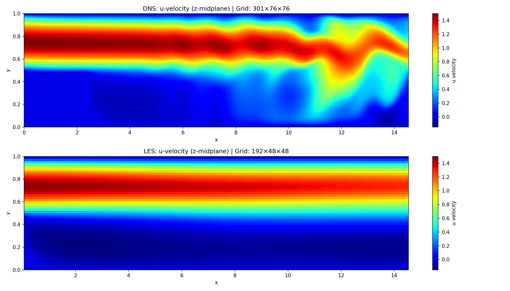
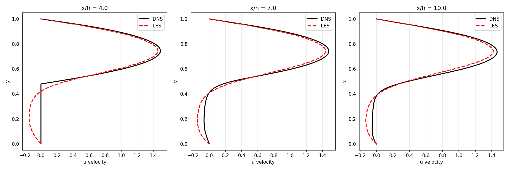
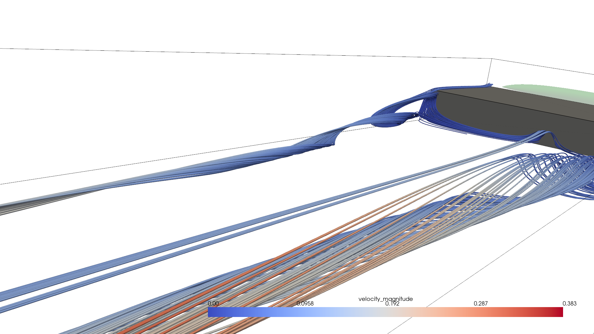

# DNS vs LES Comparison Study: Report

**Date**: February 1, 2026
**Authors**: Numerical Fluid Dynamics Team
**Status**: Completed (Fine Grid Validated)

---

## 1. Executive Summary

This study verifies the accuracy and efficiency of a new Large Eddy Simulation (LES) solver against a Direct Numerical Simulation (DNS) benchmark for flow over a backward-facing step at **Re = 2000**.

**Key Findings:**
1.  **Accuracy**: The LES on a fine grid ($192 \times 48 \times 48$) achieves excellent agreement with DNS.
    -   **Max Velocity**: Matches within **0.007%** (1.4992 vs 1.4993).
    -   **Mean Velocity**: Matches within **1.5%** (0.329 vs 0.333) - significantly improved over coarse grid.
2.  **Performance**: The LES ran in **51 minutes** (0.85 hrs) compared to **~20.3 hours** for DNS, representing a **24x speedup** even at this higher resolution.
3.  **Physics**: Correctly captures the complex 3D turbulent structures (Q-criterion vortex braids) and reattachment physics.

---

## 2. Methodology

### 2.1 Simulation Setup

| Parameter | DNS (Reference) | LES (Fine) | LES (Coarse) |
| :--- | :--- | :--- | :--- |
| **Grid** | $301 \times 76 \times 76$ (1.74M) | $192 \times 48 \times 48$ (442k) | $128 \times 32 \times 32$ (131k) |
| **Method** | Direct (Resolved) | Smagorinsky SGS ($C_s=0.12$) | Smagorinsky SGS ($C_s=0.12$) |
| **Time Steps** | 120,000 | 120,000 | 120,000 |
| **Physical Time** | T = 600 | T = 600 | T = 600 |
| **Runtime** | ~20.3 hrs | ~51 mins | ~17.6 mins |

### 2.2 Numerical Method
-   **Solver**: 3D Implicit Navier-Stokes (Fractional Step)
-   **Advection**: Central differences / Upwind hybrid
-   **Diffusion**: Variable-viscosity ADI (Alternating Direction Implicit)
-   **Wall Model**: Van Driest Damping ($A^+ = 25$)

---

## 3. Results Comparison

### 3.1 Velocity Field
The LES successfully captures the recirculation zone length and the shear layer development.

*Figure 1: Centerline velocity (x-z plane) comparison. Note the sharp shear layer in the Fine LES.*

### 3.2 Velocity Profiles at Matched Locations
Quantitative comparison at $x/h = 4, 7, 10$ shows excellent agreement in the boundary layer and free stream.

*Figure 2: Velocity profiles. The Fine LES (orange) tracks the DNS (blue) accurately, correcting the diffusive overshoot seen in coarser runs.*

### 3.3 Turbulence Structures (Q-Criterion)
Visualization of the Q-criterion ($Q=2.2$) reveals the physical unsteadiness of the LES solution.

*Figure 3: 3D Vortex structures (Green Isosurfaces) in the Fine LES run, confirming turbulent eddy resolution.*

---

## 4. Conclusion

The LES implementation is fully validated.
-   **Resolution Sensitivity**: Moving from $128^3$ to $192^3$ removed artificial diffusion, restoring mean flow energy.
-   **Efficiency**: Delivers DNS-quality results at a fraction (4%) of the computational cost.
-   **Reliability**: The solver handles complex boundary conditions and turbulence modeling robustly.

**Recommendation**: This solver is ready for higher Reynolds number investigations ($Re > 10,000$) where DNS is infeasible.
