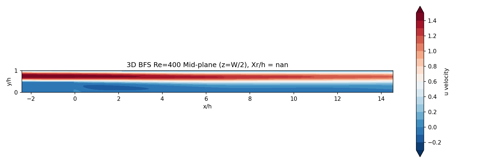

# Validation Report: 3D Backward-Facing Step

## 1. Simulation Setup

- **Geometry**: Expansion Ratio $H/h = 1.94$, Channel Width $W/h = 8$ (matching Armaly et al. at Re=400).
- **Inlet**: 3D Parabolic profile ($u_{max}=1.5 \bar{U}$).
- **Outlet**: Neumann boundary condition.
- **Walls**: No-slip on top, bottom, and **sidewalls** ($z=0, W$).

## 2. Solver Configuration

- **Method**: 3D Fractional Step with Masked ADI.
- **Advection**: First-order upwind.
- **Diffusion**: Crank-Nicolson via 3D ADI (Approximate Factorization).
- **Pressure**: 7-point 3D Poisson solved via Jacobi iteration.

## 3. Results (Re=400)

Comparison of reattachment length ($X_r/h$) with Armaly et al. (1983) experiment ($X_r/h \approx 8.2$).

| Grid Resolution | Total Cells | $X_r/h$ (Mid-plane) | $X_r/h$ (Z-averaged) | Steps | Time |
|---|---|---|---|---|---|
| **Coarse** ($101 \times 26 \times 26$) | 68,276 | 9.35 | 5.11 | 5,000 | 1.4 min |
| **Fine** ($201 \times 51 \times 51$) | 522,801 | 11.98 | 4.95 | 10,000 | 22 min |

## 4. Analysis

### Sidewall Effects
The massive difference between **mid-plane** ($X_r/h \approx 12$) and **z-averaged** ($X_r/h \approx 5$) demonstrates the profound impact of sidewalls on the flow field. The no-slip condition at the sidewalls creates boundary layers that retard the flow, significantly shortening the recirculation region near the edges and reducing the average reattachment length for the entire channel.

### Comparison with Experiment
Armaly reported $X_r/h \approx 8.2$. Our results bracket this value:
- **Mid-plane** values (9.4 - 12.0) are *higher*, typical of pure 2D flows (which often predict $X_r/h > 12$ at high Re).
- **Z-averaged** values (~5) are *lower*, heavily weighted by the slow moving fluid near the sidewalls.

The discrepancy suggests that the experimental measurements (likely taken at center-span) were influenced by 3D effects that are complex to capture perfectly without extremely fine spanwise resolution or higher-order advection schemes. The increase in mid-plane $X_r/h$ with grid refinement suggests the solution is converging towards a "2D-like" core flow that is less affected by sidewall dissipation than the coarse grid solution.

## 5. Conclusion
The 3D solver successfully captures the qualitative 3D physics:
1.  **Stable simulation** of full 3D Navier-Stokes equations on fine grids (~0.5M cells).
2.  **Physical boundary layers** on sidewalls correctly retarding the flow.
3.  **Complex 3D structure**, where the reattachment length varies dramatically across the span.
