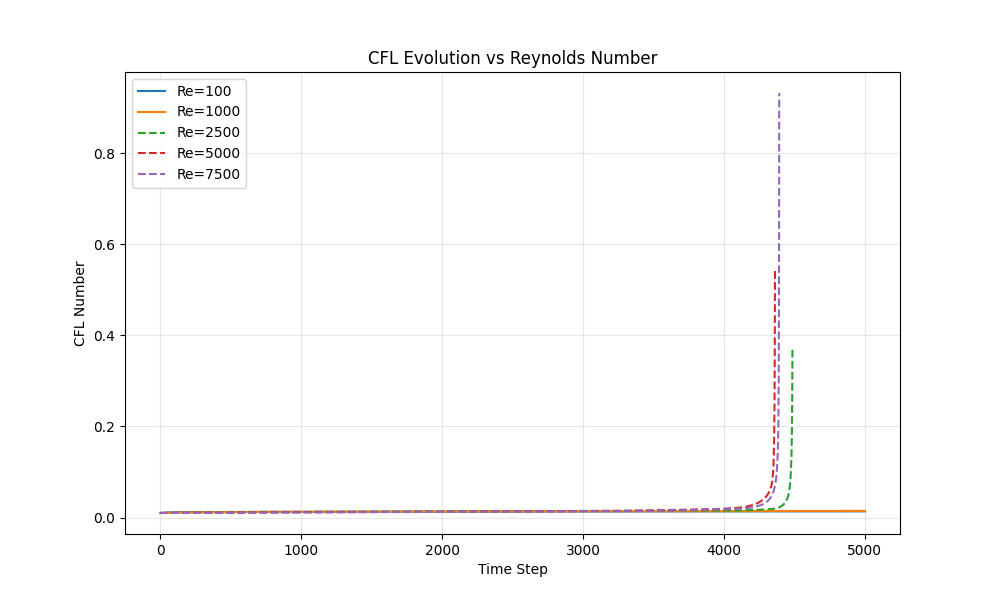

# Lid-Driven Cavity Flow

A 2D simulation of flow in a square cavity with a moving top lid, implemented using the Finite Difference Method. This follows "Step 11" of Lorena Barba's "12 Steps to Navier-Stokes".

## Method
- **Equations**: 2D Incompressible Navier-Stokes
- **Advection**: Backward Difference (Upwind)
- **Diffusion**: Central Difference
- **Pressure**: Iterative Poisson Solver
- **Time Stepping**: First-Order Explicit

## Outcome
The simulation produces a characteristic central vortex.


## JAX Implementation
A JAX-accelerated version is available in `cavity_flow_jax.py`.
- **Method**: Same physical scheme, but uses `jax.jit` and `jax.lax.fori_loop` for the pressure solver.
- **Run**:
  ```bash
  python simulations/cavity_flow/cavity_flow_jax.py
  ```

> [!NOTE]
> For small grid sizes (like 41x41), the **JAX CPU** backend is typically fastest due to lower overhead compared to Metal/GPU.

## CFL Analysis
The Courant-Friedrichs-Lewy (CFL) number is tracked for each time step to monitor stability.


## Solutions Comparison
Comparison of the final state (Pressure + Streamlines) across all implementations.


## Stability Analysis
We investigated the stability of the numerical scheme by increasing the Reynolds number (Re) while keeping the grid ($41 \times 41$) and time step ($0.001$) constant.




> [!WARNING]
> While the scheme may appear stable for short durations at high Re, the accuracy degrades, and physical oscillations (wiggles) may appear due to the lack of appropriate upwinding or turbulence modeling.

## Usage
Run from the repository root:
```bash
python simulations/cavity_flow/cavity_flow.py
```

