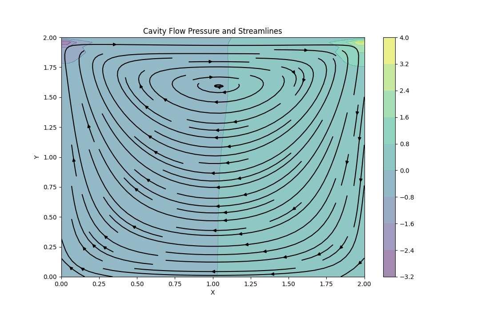
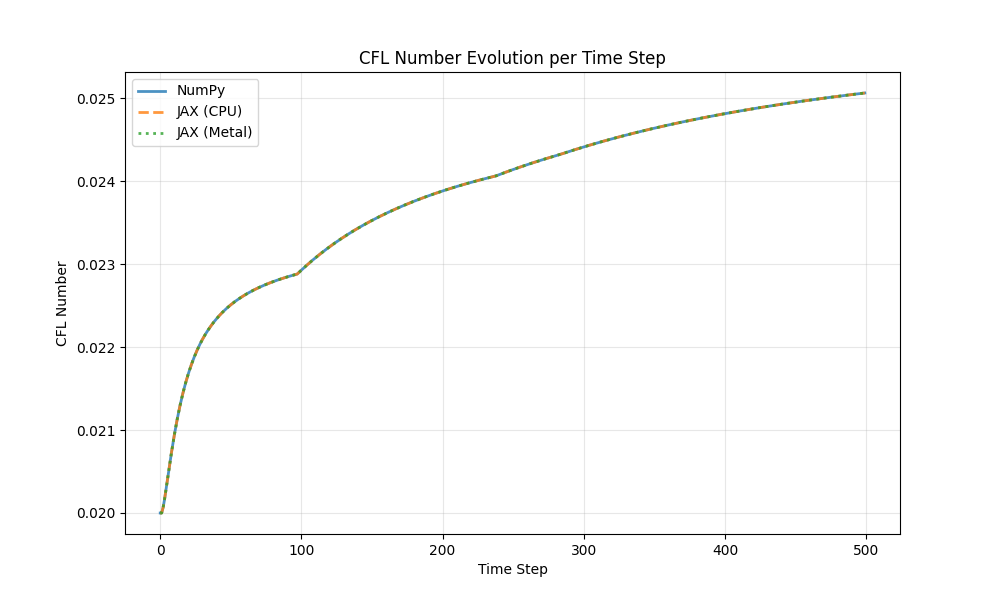
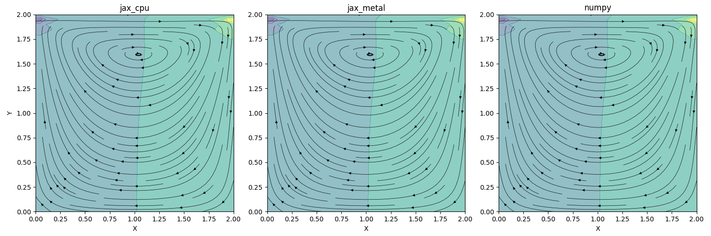
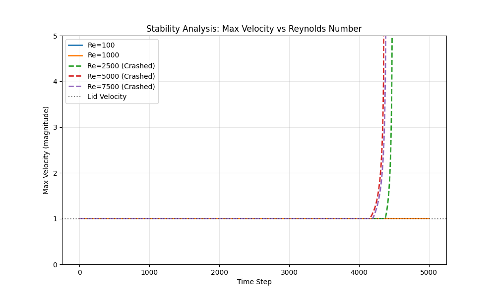

# Lid-Driven Cavity Flow

A 2D simulation of flow in a square cavity with a moving top lid, implemented using the Finite Difference Method. This follows "Step 11" of Lorena Barba's "12 Steps to Navier-Stokes".

## Acknowledgment

This implementation is based on **Step 11** from Lorena A. Barba's excellent [CFD Python](https://github.com/barbagroup/CFDPython) course: "12 Steps to Navier-Stokes". We have extended the original work with:
- JAX-accelerated implementations (CPU and Metal GPU)
- Comprehensive performance benchmarking
- Real-time stability monitoring
- Extensive stability analysis across Reynolds numbers

**Original Course:**
- Repository: [barbagroup/CFDPython](https://github.com/barbagroup/CFDPython)
- Course Website: [12 Steps to Navier-Stokes](https://lorenabarba.com/blog/cfd-python-12-steps-to-navier-stokes/)
- License: CC BY 4.0

## Method
- **Equations**: 2D Incompressible Navier-Stokes
- **Advection**: Backward Difference (Upwind)
- **Diffusion**: Central Difference
- **Pressure**: Iterative Poisson Solver (50 iterations)
- **Time Stepping**: First-Order Explicit Euler

## Outcome
The simulation produces a characteristic central vortex with secondary corner vortices at higher Reynolds numbers.



## Implementations

### NumPy Baseline (`cavity_flow.py`)
Standard implementation using NumPy arrays.

**Usage:**
```bash
# Default: 41x41 grid, Re~20, 500 steps
python simulations/cavity_flow/cavity_flow.py

# Custom Reynolds number
python simulations/cavity_flow/cavity_flow.py --re 1000 --nx 201 --nt 5000 --dt 0.0001

# Benchmark mode (minimal output)
python simulations/cavity_flow/cavity_flow.py --benchmark
```

**Arguments:**
- `--nx INT`: Grid points in X and Y (default: 41)
- `--nt INT`: Number of time steps (default: 500)
- `--re FLOAT`: Reynolds number (overrides nu)
- `--dt FLOAT`: Time step size (default: 0.001)
- `--output-dir PATH`: Output directory for data files (default: outputs/baseline)
- `--verbose`: Show real-time stability monitoring
- `--benchmark`: Minimal output mode

### JAX Implementation (`cavity_flow_jax.py`)
Accelerated version using JAX with JIT compilation.

**Usage:**
```bash
# Auto-detect backend (CPU or Metal)
python simulations/cavity_flow/cavity_flow_jax.py

# Force CPU backend (recommended for most cases)
JAX_PLATFORMS=cpu python simulations/cavity_flow/cavity_flow_jax.py

# High Reynolds number with CPU backend
JAX_PLATFORMS=cpu python simulations/cavity_flow/cavity_flow_jax.py --re 1000 --nx 201 --nt 5000 --dt 0.0001

# Verbose monitoring with CPU backend
JAX_PLATFORMS=cpu python simulations/cavity_flow/cavity_flow_jax.py --verbose
```

**Arguments:** Same as NumPy version

> [!NOTE]
> For small grids (41x41), **JAX CPU** is fastest (~5.7x faster than NumPy). Metal GPU has overhead that dominates for small problems.

## Real-Time Stability Monitoring

Both implementations support **verbose mode** for real-time monitoring of numerical stability during simulation.

### Enable Verbose Mode

```bash
# NumPy with verbose monitoring
python simulations/cavity_flow/cavity_flow.py --verbose

# JAX CPU with verbose monitoring (recommended)
JAX_PLATFORMS=cpu python simulations/cavity_flow/cavity_flow_jax.py --verbose
```

### What You See

**Pre-flight Check:**
```
Pre-flight Stability Check:
  Max dt (diffusion): 0.006250
  Your dt: 0.001000
  Safety factor: 6.25x
```

**Real-time Monitoring:**
```
================================================================================
REAL-TIME STABILITY MONITORING
================================================================================
Step     Time       u_max    v_max    CFL      D_num    Status    
--------------------------------------------------------------------------------
0        0.0000     1.0000   0.0000   0.0200   0.0400   ✓ STABLE  
50       0.0500     1.0000   0.1255   0.0225   0.0400   ✓ STABLE  
100      0.1000     1.0000   0.1463   0.0229   0.0400   ✓ STABLE  
150      0.1500     1.0000   0.1763   0.0235   0.0400   ✓ STABLE  
```

### Monitoring Metrics

| Metric | Description | Stability Criterion |
|--------|-------------|---------------------|
| **u_max** | Maximum x-velocity | Informational |
| **v_max** | Maximum y-velocity | Informational |
| **CFL** | Courant-Friedrichs-Lewy number | Must be < 1.0 |
| **D_num** | Diffusion number: $\nu \Delta t / \Delta x^2$ | Must be ≤ 0.25 |

### Status Indicators

- **✓ STABLE**: CFL < 0.8 and D_num < 0.2 (safe)
- **⚠ WARNING**: CFL ≥ 0.8 or D_num ≥ 0.2 (borderline)
- **✗ UNSTABLE**: CFL > 1.0 or D_num > 0.25 (will crash)

### Output Files

Verbose mode generates additional monitoring data:

```
outputs/baseline/
├── cfl_numpy.csv              # CFL history (all modes)
├── monitoring_numpy.csv       # Detailed metrics (verbose only)
├── solution_numpy.npz         # Final solution
└── ...
```

**Monitoring CSV format:**
```csv
step,time,u_max,v_max,cfl,diffusion_num,stable
0,0.0,1.0,0.0,0.02,0.04,True
50,0.05,1.0,0.125,0.0225,0.04,True
...
```

### When to Use Verbose Mode

**Use `--verbose` when:**
- Testing new parameter combinations
- Debugging instability issues
- Learning about numerical stability
- Running high Reynolds number simulations

**Use default mode when:**
- Running production benchmarks
- Parameters are known to be stable
- You just want the final result

## Output Structure

```
simulations/cavity_flow/
├── outputs/
│   ├── baseline/          # Default benchmark data
│   │   ├── solution_numpy.npz
│   │   ├── solution_jax_cpu.npz
│   │   ├── solution_jax_metal.npz
│   │   ├── cfl_numpy.csv
│   │   ├── cfl_jax_cpu.csv
│   │   └── cfl_jax_metal.csv
│   └── high_re/           # High Reynolds data
│       └── ...
└── plots/                 # Visualizations (tracked in git)
    ├── cavity_flow_result.png
    ├── cfl_comparison.png
    ├── solutions_comparison.png
    ├── stability_velocity.png
    └── stability_cfl.png
```

## Benchmarking

### Baseline Benchmark
Compare all three implementations (NumPy, JAX CPU, JAX Metal) on default settings:
```bash
./run_benchmark.sh
```

Generates:
- `plots/cfl_comparison.png` - CFL evolution comparison
- `plots/solutions_comparison.png` - Side-by-side solution comparison

### High Reynolds Benchmark
Test Re=1000 on 201x201 grid:
```bash
./run_high_re.sh
```

Generates:
- `plots/solutions_comparison_re1000.png`

## Analysis Results

### CFL Analysis
The Courant-Friedrichs-Lewy (CFL) number is tracked for each time step to monitor stability.



### Solutions Comparison
Comparison of the final state (Pressure + Streamlines) across all implementations.



### Stability Analysis
We investigated the stability of the numerical scheme by increasing the Reynolds number on a $201 \times 201$ grid with $\Delta t = 0.0001$.




> [!IMPORTANT]
> **Resolution Matters**: The simulation is **stable at Re=1000** on a 201×201 grid. However, instability occurs at Re≥2500 where the simulation crashes around step 4500. This confirms that higher Re requires finer meshes to resolve the thinner boundary layers.

### High Reynolds Comparison ($Re=1000$)
Using the $201 \times 201$ grid, we successfully computed stable flow at $Re=1000$.


> [!NOTE]
> **Performance** (201×201 grid, 5000 steps):
> - **NumPy**: ~39s
> - **JAX (CPU)**: ~11s (**3.5x faster**)
> - **JAX (Metal)**: ~22s (Slower than CPU due to dispatch overhead)
>
> **CPU vs Metal Crossover** (explicit scheme):
> | Grid Size | CPU (fps) | Metal (fps) | Winner |
> |-----------|-----------|-------------|--------|
> | 501×501 | 56.0 | 38.0 | CPU (1.5x) |
> | 1001×1001 | 8.1 | **8.9** | Metal (1.1x) |
>
> Metal GPU only wins at ~1 million+ grid points.

## Theory

See [Cavity Flow Theory](../../docs/cavity_flow_theory.md) for detailed mathematical derivations and discretization schemes.

## References

Barba, Lorena A., and Forsyth, Gilbert F. (2018). CFD Python: the 12 steps to Navier-Stokes equations. *Journal of Open Source Education*, 1(9), 21, https://doi.org/10.21105/jose.00021

**GitHub Repository:** https://github.com/barbagroup/CFDPython
