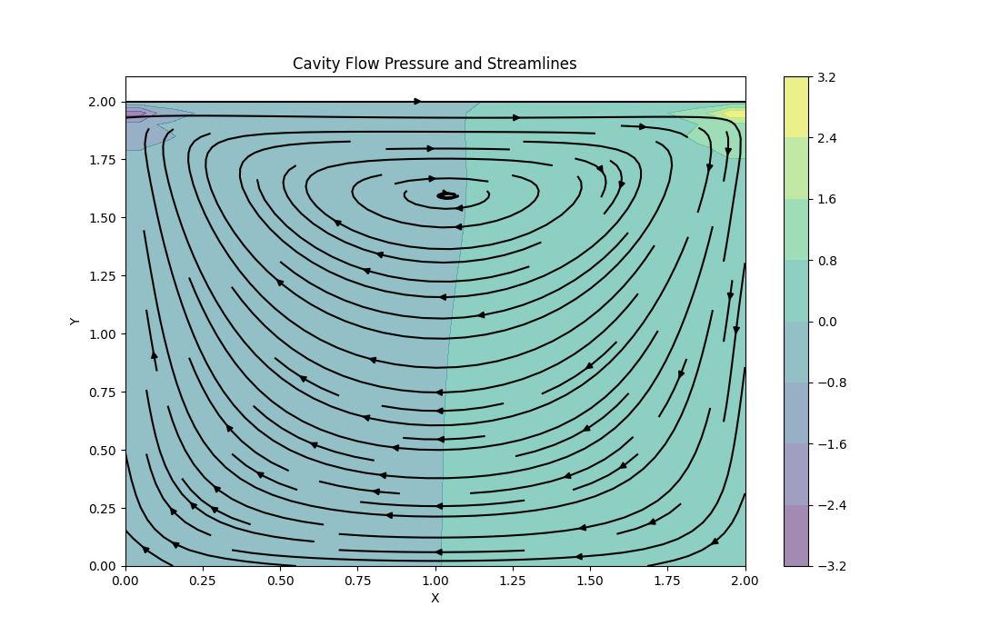

# Lid-Driven Cavity Flow

A 2D simulation of flow in a square cavity with a moving top lid, implemented using the Finite Difference Method. This follows "Step 11" of Lorena Barba's "12 Steps to Navier-Stokes".

## Method
- **Equations**: 2D Incompressible Navier-Stokes
- **Advection**: Backward Difference (Upwind)
- **Diffusion**: Central Difference
- **Pressure**: Iterative Poisson Solver
- **Time Stepping**: First-Order Explicit

## Outcome
The simulation produces a characteristic central vortex.



## Usage
Run from the repository root:
```bash
python simulations/cavity_flow/cavity_flow.py
```
